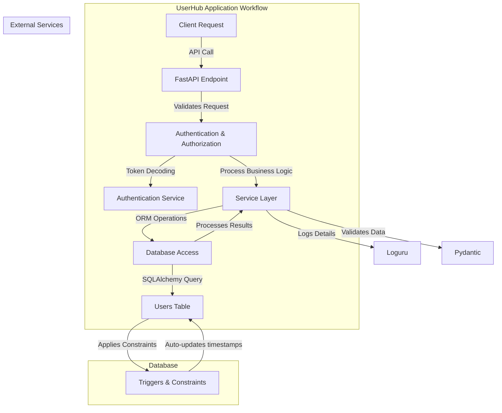

# OpenAuthGuard Users Manage Services

UserHub is a FastAPI-based microservice designed for managing individual user accounts. It provides endpoints for user registration, profile management, and authentication. It integrates with a PostgreSQL database and includes secure password handling and JWT-based authentication.

---

📘 **[API Documentation](docs/API.md)**  
For detailed information on available endpoints, request formats, and response structures, check out the [API Documentation](docs/api.md).


## Table of Contents

- [OpenAuthGuard Users Manage Services](#openauthguard-users-manage-services)
  - [Table of Contents](#table-of-contents)
  - [Features](#features)
    - [Core Features](#core-features)
  - [Architecture](#architecture)
    - [Highlights of the Database Workflow](#highlights-of-the-database-workflow)
  - [Contributing to OpenAuthGuard UserHub](#contributing-to-openauthguard-userhub)
    - [Getting Started](#getting-started)
    - [Coding Guidelines](#coding-guidelines)
    - [Workflow for Contributions](#workflow-for-contributions)
    - [Code of Conduct](#code-of-conduct)
    - [Need Help?](#need-help)

## Features

### Core Features

- **User Registration**: Create new user accounts with unique usernames and email addresses.
- **User Profile Management**: Update user details such as first name, last name, address, and phone number.
- **Secure Authentication**:
  - Hashing passwords using bcrypt.
  - JWT-based access token generation and validation.
- **Health Check**: Service and database status verification through a dedicated health endpoint.
- **Role Management**: Assign and manage user roles (`user`, `admin`).

## Architecture



1.  **Client Request**:

    - The user sends a request (e.g., login, registration, profile update) to the API.

2.  **FastAPI Endpoint**:

    - The endpoint identifies the request type and invokes the appropriate route handler.
    - Input data is validated using **Pydantic** models.

3.  **Authentication & Authorization**:

    - The request is checked for a valid JWT token. If required, external authentication services validate the token or provide authorization.

4.  **Service Layer**:

    - Contains the core business logic, like hashing passwords, creating new users, or updating existing records.

5.  **Database Access**:

    - Uses SQLAlchemy to interact with the PostgreSQL database.
    - Executes queries such as SELECT, INSERT, or UPDATE on the `users` table.

6.  **Database Workflow**:

    - PostgreSQL applies constraints like unique constraints on `email` and `username` to ensure data integrity.
    - Triggers automatically update timestamps (`created_at`, `updated_at`) as needed.

7.  **Processing Results**:

    - Query results are processed and returned to the client after being formatted into the appropriate response schema.
    - Errors, such as constraint violations, are logged and appropriately handled.

8.  **Logging**:

    - Key events, such as query execution, errors, and API interactions, are logged using **Loguru** for observability and debugging.

### Highlights of the Database Workflow

- **Constraints**: Ensures data integrity through unique constraints and schema validation.
- **Triggers**: Automates timestamp updates for `created_at` and `updated_at` fields.
- **Error Handling**: Prevents invalid data insertion with detailed logging for troubleshooting.

## Contributing to OpenAuthGuard UserHub

I welcome contributions to improve OpenAuthGuard UserHub! Whether you're fixing a bug, proposing a new feature, or enhancing documentation, your help is greatly appreciated.

---

### Getting Started

1. **Fork the Repository**  
   Start by forking this repository to your own GitHub account.

2. **Clone the Repository**  
   Clone your fork locally to begin making changes:

   ```bash
   git clone https://github.com/maestrogrand/openauthguard-userhub.git
   cd openauthguard-userhub`

   ```

3. **Set Up Your Development Environment**  
   I have a convenient `ctl.sh` script to handle setup tasks. Use it to save time.

   - Set up your environment with:

     `./ctl.sh start dev`

     This will:

     - Create a virtual environment if not already created.
     - Activate the environment.
     - Install dependencies.
     - Load environment variables from `.env.dev`.

   Alternatively, you can perform these steps manually:

   - Create and activate a virtual environment:

     `python3 -m venv userhub_env
source userhub_env/bin/activate`

   - Install dependencies:

     `pip install --upgrade pip
pip install -r requirements.txt`

   - Set up environment variables by creating a `.env` file. Use `.env.dev` as a reference.

4. **Run the Application**  
   Start the development server:

   `./ctl.sh start dev`

   This script automatically frees any conflicting ports and launches the application.  
   Alternatively, you can run:

   `uvicorn src.main:app --host 0.0.0.0 --port 50042 --reload`

5. **Run Tests**  
   Use the `ctl.sh` script to run tests:

   `./ctl.sh test dev`

   Or manually:

   `pytest tests`

---

### Coding Guidelines

To maintain consistency and code quality:

- Follow PEP 8 standards.
- Use `flake8` for linting:

  `./ctl.sh lint`

  Or manually:

  `flake8 src`

- Format your code using `black`:

  `./ctl.sh format`

  Or manually:

  `black src tests`

---

### Workflow for Contributions

1.  **Create a Branch**  
    Create a new branch for your changes:

    `git checkout -b feature/<feature-name>`

2.  **Make Your Changes**  
    Write clean, well-documented code.
3.  **Commit Your Changes**  
    Use meaningful commit messages:

    `git add .
git commit -m "Add feature: <feature-description>"`

4.  **Push Your Changes**  
    Push your branch to your forked repository:

    `git push origin feature/<feature-name>`

5.  **Submit a Pull Request**  
    Go to the original repository and submit a pull request (PR) from your branch. Ensure you:

    - Describe the changes you've made.
    - Reference any related issues.

---

### Code of Conduct

By contributing, you agree to uphold our [Code of Conduct](docs/CODE_OF_CONDUCT.md). Be respectful, collaborative, and supportive of all contributors.

---

### Need Help?

If you have questions or need assistance, feel free to:

- Open an issue in the repository.
- Reach out to me via linkedin

I am excited to have you contribute and help make OpenAuthGuard UserHub even better!
